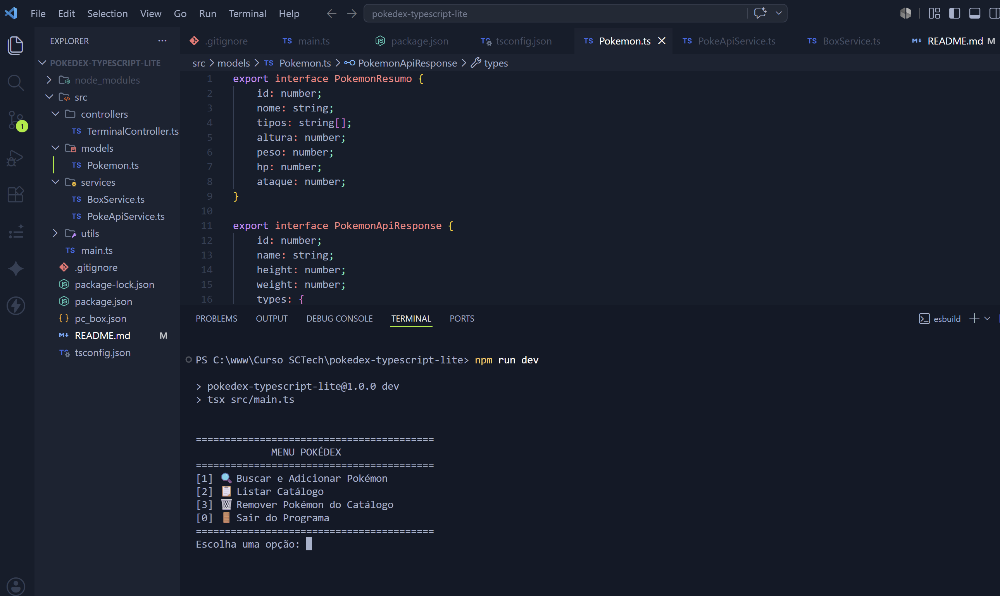
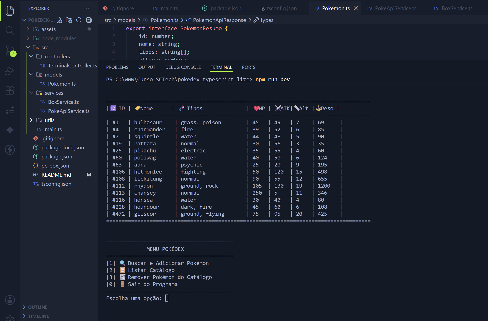
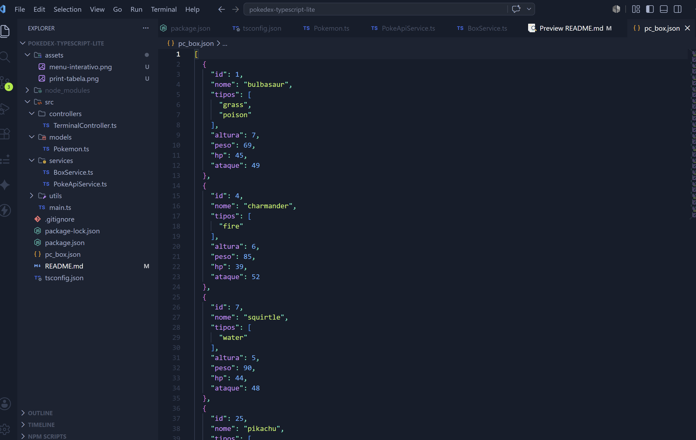

  <h1>🦊 Pokédex TypeScript Lite 🔴⚪</h1>
  
  
  

---
## 📖 Sobre o projeto
O Pokédex TypeScript Lite é uma aplicação de terminal construída em Node.js com TypeScript. O sistema consulta dados em tempo real na PokeAPI, processa as informações e gerencia um catálogo local de Pokémon durante a execução do programa, oferecendo uma experiência interativa ao usuário.

## 🎯 Objetivo
Praticar e consolidar os principais conceitos de back-end do Módulo 01:
- Node.js e JavaScript no lado do servidor.
- TypeScript (tipagem forte, interfaces e classes).
- Manipulação de arrays e objetos (estruturas JSON).
- Consumo de APIs externas assíncronas (fetch, async/await).
- Tratamento de erros e exceções.
- Versionamento e organização ágil (Git, GitHub, GitFlow, Kanban).

## 🚀 Tecnologias utilizadas
- **Node.js** (Ambiente de execução)
- **TypeScript & TSX** (Linguagem e compilador de execução)
- **PokeAPI** (Fonte de dados externa REST)
- **Git & GitHub** (Versionamento de código)

## ⚠️ Pré-requisitos
Antes de executar o projeto, certifique-se de ter instalado em sua máquina:
- Node.js (Versão LTS recomendada)
- npm (Gerenciador de pacotes do Node)
- Git

---

## 💻 Como instalar e rodar o projeto

**1. Clone o repositório:**

    git clone https://github.com/MariaAlineMees/pokedex-typescript-lite.git

**2. Acesse a pasta do projeto:**

    cd pokedex-typescript-lite

**3. Instale as dependências:**

    npm install

**4. Execute o projeto em ambiente de desenvolvimento:**

    npm run dev

---

## 📂 Estrutura e Explicação dos Arquivos
O projeto foi organizado em camadas arquiteturais para isolar responsabilidades. Abaixo está a árvore do projeto e a explicação de cada arquivo:

    pokedex-typescript-lite/
    ├── assets/
    │   ├── menu-interativo.png         # Captura de tela do menu
    │   ├── print-tabela.png            # Captura de tela da tabela de listagem
    │   └── print-json.png              # Captura de tela do banco de dados
    ├── src/
    │   ├── controllers/
    │   │   └── TerminalController.ts   # Gerencia a interface e os menus do terminal
    │   ├── models/
    │   │   └── Pokemon.ts              # Define as Interfaces (tipagens) dos dados
    │   ├── services/
    │   │   ├── BoxService.ts           # Lida com a lógica de salvar, listar e remover localmente
    │   │   └── PokeApiService.ts       # Lida exclusivamente com as requisições HTTP (fetch)
    │   └── main.ts                     # Ponto de entrada que inicializa a aplicação
    ├── pc_box.json                     # Banco de dados local (gerado automaticamente)
    ├── package.json                    # Gerenciador de dependências e scripts
    ├── tsconfig.json                   # Configurações do compilador TypeScript
    └── README.md                       # Documentação do projeto

## ✨ Funcionalidades
- [x] 🔍 Buscar Pokémon por nome ou ID diretamente da PokeAPI.
- [x] 🛡️ Tratar erros de busca (ex: Pokémon inexistente) sem quebrar o sistema.
- [x] 📦 Transformar e simplificar o objeto complexo de resposta da API.
- [x] ➕ Adicionar Pokémon ao catálogo local com bloqueio contra duplicatas.
- [x] 📋 Listar o catálogo de forma organizada.
- [x] 🗑️ Remover Pokémon do catálogo utilizando o ID.
- [x] 💬 Exibir mensagens e feedbacks visuais claros no terminal.
- [x] 🌟 **Extra:** Menu interativo em loop no terminal.
- [x] 🌟 **Extra:** Salvar catálogo de forma persistente em arquivo pc_box.json.
- [x] 🌟 **Extra:** Exibição de atributos de combate avançados (HP e Ataque Base).

---

## 📸 Exemplos de execução

### 1. Menu Interativo Principal
Abaixo, a interface de controle do sistema aguardando a entrada do usuário:

### 2. Listagem do Catálogo (Tabela)
Demonstração da listagem formatada e ordenada por ID, exibindo os dados persistidos:

### 3. Persistência de Dados (JSON)
Arquivo pc_box.json gerado automaticamente pelo sistema, armazenando os dados formatados do catálogo localmente:

---

## 🧠 Conceitos aplicados

* **TypeScript e Interfaces:** A tipagem forte foi garantida através do uso de Interfaces (PokemonResumo e PokemonApiResponse) para mapear os objetos esperados da API e atuar como molde seguro da entidade principal.
* **Fetch e async/await:** A integração foi implementada na classe PokeApiService. A função de busca utiliza fetch nativo e async/await para realizar requisições HTTP e aguardar a resposta de forma assíncrona.
* **Tratamento de erros:** A aplicação é protegida por try/catch. Verificações interceptam retornos 404 da PokeAPI, garantindo que o programa apenas exiba avisos no terminal.
* **Métodos de Array Integrados:** * map() para extrair tipos;
  * some() para impedir IDs duplicados;
  * forEach() para iterar e exibir o catálogo;
  * filter() para reconstruir arrays nas remoções;
  * sort() para ordenação crescente;
  * find() para extrair status (HP/ATK).
* **Orientação a Objetos (POO):** Uso de Classes (CatalogoPokemon) com atributos privados para encapsulamento e métodos expostos para manipulação segura dos dados.

---

## 📋 Organização e Versionamento
- **Link do Kanban (Gestão de Tarefas):** [Acessar Board](https://github.com/users/MariaAlineMees/projects/1/views/1)
- **Branches utilizadas no GitFlow:**
  - main (Produção)
  - develop (Desenvolvimento contínuo)
  - feat/pokedex (Implementação de funcionalidades)

---

## ✒️ Autoria

Projeto desenvolvido por **Maria Aline Mees**, estudante de Sistemas de Informação na UFBRA.  
*Desenvolvido durante o programa SCTec como mini-projeto avaliativo do Módulo 01.*